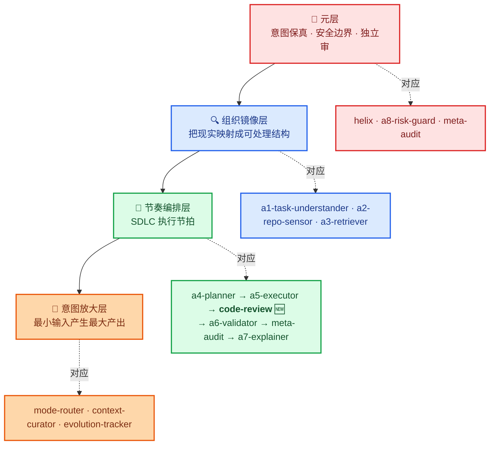
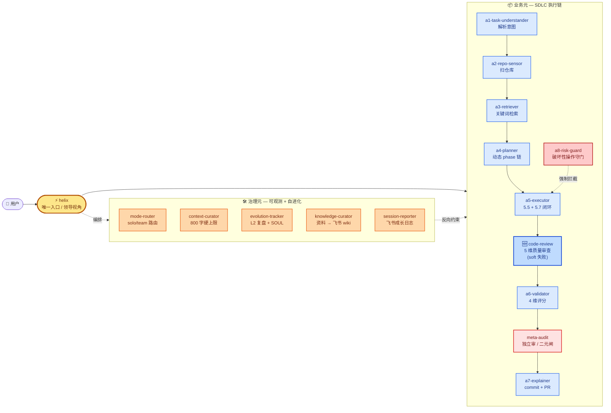
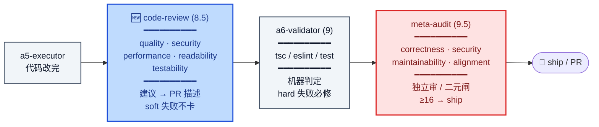
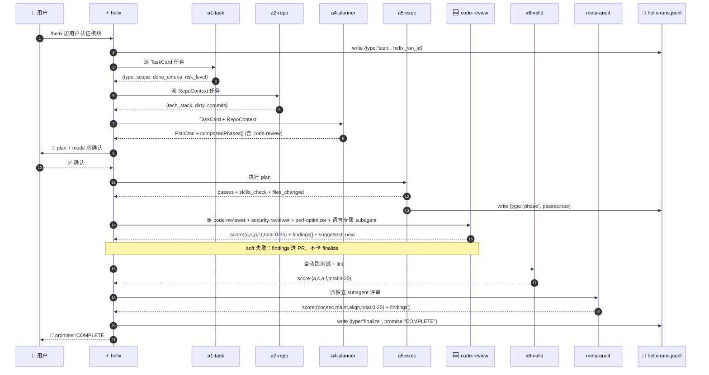
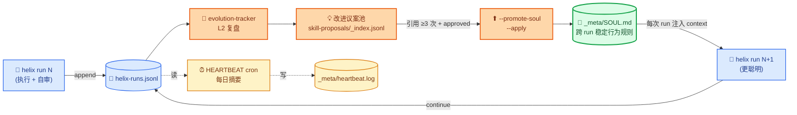

# Alex-harness

> Alex 的私人 SDLC Agent Harness —— 基于 OpenAI Harness Engineering 三部曲 + 元思想，让 Claude 在编程协作中更可控、可观测、可自我进化。
>
> **当前版本：v0.7.2**（2026-5-11，新增 code-review 质量元）· 工作目录：`/Users/a1234/person/ai/study/Alex-harness/`

---

## 📚 目录

- [一句话讲清楚](#一句话讲清楚)
- [图 1：四层元思想架构](#图-1四层元思想架构)
- [图 2：/helix 10-phase 流程](#图-210-phase-helix-流程)
- [图 3：15 个 skill 的组织关系](#图-315-个-skill-的组织关系)
- [图 4：一次 run 的数据流](#图-4一次-run-的数据流)
- [图 5：自进化闭环](#图-5自进化闭环)
- [安装](#安装)
- [快速上手](#快速上手)
- [Skills 全览（表格）](#skills-全览)
- [设计原则](#设计原则)
- [项目结构](#项目结构)
- [里程碑](#里程碑)

---

## 一句话讲清楚

```
你说一句话 → /helix 接住 → 10 个 phase 自动跑 → 每步二元 passes 判定
            → 4 类 reviewer subagent 独立审（quality/security/perf/readability/testability）
            → meta-audit 独立二元闸 → 你拍板确认 → 输出 promise=COMPLETE
            → 沉淀到 SOUL.md → 下次更聪明
```

**核心赌注**：层级 + 独立评审是真胜负手，单纯并行 agent 效应有限。
**v0.7.2 新增**：code-review 质量元——专业开发者必备的安全/质量/性能/可读性/可测性 5 维审查，soft 失败不打断节奏。

---

## 图 1：四层元思想架构

> **怎么读**：从上到下是抽象层 → 具象层。每层负责一类问题，互不越界。颜色编码贯穿全文（红=元层，蓝=镜像，绿=节奏，橙=放大）。



---

## 图 2：10-phase helix 流程

> **怎么读**：菱形是决策点，矩形是 phase。红色边框 = 强制人工卡点；蓝色 = 质量审查；虚线 = 可跳过；🛑 = Ralph 二元 passes 关。**v0.7.2 新增 Step 8.5 code-review 质量元**（专业开发者视角，soft 失败不卡 finalize）。

```mermaid
flowchart TD
    classDef phase fill:#f1f5f9,stroke:#475569,stroke-width:1.5px,color:#0f172a
    classDef gate fill:#fef3c7,stroke:#d97706,stroke-width:2.5px,color:#78350f
    classDef review fill:#dbeafe,stroke:#2563eb,stroke-width:2px,color:#1e3a8a
    classDef audit fill:#fee2e2,stroke:#dc2626,stroke-width:2px,color:#7f1d1d
    classDef done fill:#dcfce7,stroke:#16a34a,stroke-width:2px,color:#14532d
    classDef optional stroke-dasharray:5 5

    USER([👤 用户一句话])
    USER --> S0

    S0[["Step 0.5<br/>mode-router --coarse<br/>solo/team 预判"]]:::phase
    S0 --> S3
    S3[["Step 3<br/>a1-task-understander<br/>→ TaskCard"]]:::phase
    S3 --> S4
    S4[["Step 4<br/>a2-repo-sensor<br/>→ RepoContext"]]:::phase
    S4 --> S5
    S5[["Step 5<br/>a3-retriever<br/>关键词检索"]]:::phase
    S5:::optional
    S5 --> S55
    S55{{"Step 5.5<br/>skill 最优选择<br/>强匹配必须复用"}}:::gate
    S55 --> S6
    S6[["Step 6<br/>a4-planner<br/>→ composedPhases[]"]]:::phase
    S6 --> S57
    S57{{"Step 5.7<br/>mode-router --fine<br/>100% 精确硬契约"}}:::gate
    S57 --> S7
    S7{{"🛑 Step 7<br/>用户确认 plan + mode"}}:::gate
    S7 --> S8
    S8[["Step 8<br/>a5-executor<br/>5.5 + 5.7 双闭环"]]:::phase
    S8 --> S85
    S85[["🆕 Step 8.5<br/>code-review<br/>5 维评分 0-25<br/>quality·security·perf·readability·testability<br/>soft 失败"]]:::review
    S85 --> S9
    S9[["Step 9<br/>a6-validator<br/>4 维评分 0-20"]]:::phase
    S9 --> S95
    S95[["Step 9.5<br/>meta-audit<br/>独立 subagent 评审<br/>4 维 0-20，二元闸"]]:::audit
    S95 --> S10
    S10[["Step 10<br/>a7-explainer<br/>commit msg + PR 描述"]]:::phase
    S10 --> FIN
    FIN(["🏁 helix --finalize<br/>promise=COMPLETE | NOT_COMPLETE<br/>(code-review soft-fail 不影响)"]):::done
```



**三层防护对比**（v0.7.2 起 SDLC 链有 3 个质量关卡）：

| Phase | 谁判 | 维度 | 失败成本 | 关心 |
|---|---|---|---|---|
| Step 9 `a6-validator` | 机器（tsc/eslint/test） | 1 维：所有 check 是否过 | **硬**：不修不能合并 | 能不能跑 |
| Step 8.5 `code-review` 🆕 | LLM subagent ×4 | **5 维**：quality·security·**perf**·readability·testability | **软**：findings 进 PR，不卡 finalize | 怎么改更好 |
| Step 9.5 `meta-audit` | LLM 独立 subagent | 4 维：correctness·security·maintainability·alignment | 中：12-19 软回 a5，<10 卡 | 值不值得 ship |

**phase 链由 a4 动态决定**：

| 任务类型 | 跑哪些 phase |
|---|---|
| `research` / `design` | 跳过 a5/code-review/a6/meta-audit/a7（无代码改动） |
| `feature` / `refactor` / `bugfix` | **跑全 10 phase**（含 code-review + meta-audit）|
| `explain` | 只跑 a1 + a3 + a7 |

---

## 图 3：15 个 skill 的组织关系

> **怎么读**：两大块——**业务元**（SDLC 执行链）和**治理元**（横切，给执行链上锁）。helix 是唯一暴露的入口；其他 14 个不能单独触发。**v0.7.2 起业务元有 3 个质量关卡**：a6（机器）+ code-review（建议）+ meta-audit（二元闸）。



### code-review × meta-audit × a6-validator 三层防护

> **怎么读**：业务元里有 **3 个递进的质量关卡**，每个 reviewer 都是独立 subagent，避免自审自荐。



---

## 图 4：一次 run 的数据流

> **怎么读**：上下泳道。**实线**=数据传递，**虚线**=写日志。每个 phase 都自留底，三类行（start/phase/finalize）进 `helix-runs.jsonl`。



---

## 图 5：自进化闭环

> **怎么读**：每次 run 的日志 → evolution-tracker 蒸馏 → 高频议案 → 沉淀到 `SOUL.md` → 下一次 run 自动遵循。这是 harness 自己"长记性"的机制。



---

## 安装

### 方式一：插件安装（推荐）

```
/plugin marketplace add Alex-nx-netizen/Alex-harness
/plugin install alex-harness@Alex-nx-netizen/Alex-harness
```

安装后**唯一暴露 `/helix` 入口**，13 个下属 skill 不再单独可见。

### 方式二：克隆到项目

```bash
git clone https://github.com/Alex-nx-netizen/Alex-harness.git
cd Alex-harness
# 用 Claude Code 打开此目录，skills/ 下自动加载
```

---

## 快速上手

```bash
/helix 帮我给这个项目加用户认证模块
/helix 修复 src/api/payment.ts 里的并发 bug
/helix 解释 _meta/task_plan.md 里的任务计划
```

### 手动子命令（调试用）

```bash
node skills/helix/run.cjs --start "<task>"         # 启动 run
node skills/helix/run.cjs --finalize               # 收尾，生成 promise
node skills/helix/run.cjs --finalize-session       # 推送当日 session 摘要到飞书
node skills/helix/run.cjs --status                 # 查看当前 active run
```

---

## Skills 全览

### 业务元（SDLC 执行链 · a1-a8 + 质量审查 ×2）

| Skill | 职责 | 关键输出 |
|---|---|---|
| `helix` | 唯一入口，编排 a1-a8 + code-review + meta-audit | `helix-runs.jsonl` 三类行 + `promise: COMPLETE\|NOT_COMPLETE` |
| `a1-task-understander` | 解析任务意图 → TaskCard | `{type, scope, out_of_scope, done_criteria, risk_level, preferred_skills}` |
| `a2-repo-sensor` | 扫仓库结构、技术栈、commit、dirty | RepoContext JSON |
| `a3-retriever` | 关键词检索 | `keywords[]` + scope（多数任务可跳） |
| `a4-planner` | TaskCard 校验 + 输出 `composedPhases[]`（v0.7 动态） | PlanDoc + preferred_skills 透传 |
| `a5-executor` | 用户确认后执行 + 5.5/5.7 双闭环 | passes + skills_check + mode_check |
| `code-review` 🆕 v0.7.2 | **专业开发者视角质量审查**：code-reviewer + security-reviewer + performance-optimizer + 语言专属 reviewer 4 类独立 subagent，**5 维评分**（quality·security·**performance**·readability·testability，0-25），soft 失败不卡 finalize | `{score, has_recommendations, by_severity, by_dimension, findings[], suggested_next}` |
| `a6-validator` | 检测项目类型跑测试/lint + **4 维评分** | `{passes, score:{accuracy,completeness,actionability,format,total:0-20}}` |
| `meta-audit` | **独立 subagent 评审 / 二元闸** | `{score:{correctness,security,maintainability,alignment,total:0-20}, findings[]}` |
| `a7-explainer` | 生成 commit message / PR 描述 | 英文 commit ≤72 字符 + 中文 PR 描述 |
| `a8-risk-guard` | 破坏性操作前强制风险评估 | LOW/HIGH/CRITICAL 分级 |

### 治理元（可观测性 + 自我进化）

| Skill | 职责 | 触发 |
|---|---|---|
| `mode-router` | 双阶段路由（粗 0.5 + 细 5.7），输出 `solo / team[subagent_parallel\|manager_worker\|peer_review]` | helix 自动 |
| `context-curator` | 跨会话上下文压缩 + 7 级削减阶梯（800 字硬上限） | helix 软约束 |
| `evolution-tracker` | runs.jsonl → L2 复盘 → 改进议案；`--promote-soul` 沉淀 SOUL.md | helix 软约束 / 手动 |
| `knowledge-curator` | 整理飞书/网页资料 → 飞书 wiki | `--finalize-session` 触发 |
| `session-reporter` | 推飞书成长日志 Base + IM | `--finalize-session` 触发 |

---

## 设计原则

1. **最小输入，最大产出** —— 一句话触发 `/helix`，9 个 phase 自动编排
2. **强制安全边界** —— a8-risk-guard 在破坏性操作前强制评估，不可催促降级
3. **独立审兜底** —— meta-audit 必须独立 subagent 评，避免自审自荐
4. **二元 passes 契约（Ralph）** —— 所有 phase 输出 `passes:true|false`，agent 自宣告 COMPLETE 也得人审
5. **机器化卡点** —— 5.5 闭环（preferred_skills × skills_used）+ 5.7 闭环（mode × subagent_run_ids）；`bypass_allowed=false`
6. **可观测、可追溯** —— 每个 skill 自留底 `runs.jsonl`，helix 全程进 `helix-runs.jsonl`
7. **写后必校验** —— JSON/JSONL 写完 `JSON.parse` 立刻校验（CLAUDE.md 工作约定 #8）
8. **小步迭代** —— 一次只做一件事，每件事进 progress.md，文档带 `v0.x` 修订历史

---

## 项目结构

```
Alex-harness/
├── .claude-plugin/
│   ├── plugin.json                   # 插件清单（v0.7.1）
│   └── marketplace.json
├── skills/                           # 15 个 skill（plugin 模式）
│   ├── helix/                        # 唯一入口
│   ├── a1-task-understander/
│   ├── a2-repo-sensor/
│   ├── a3-retriever/
│   ├── a4-planner/                   # composedPhases 默认含 code-review
│   ├── a5-executor/
│   ├── code-review/                  # v0.7.2 新增：5 维质量审查（soft 失败）
│   ├── a6-validator/
│   ├── a7-explainer/
│   ├── a8-risk-guard/
│   ├── meta-audit/                   # v0.7 新增
│   ├── context-curator/
│   ├── evolution-tracker/
│   │   └── lib/promote_soul.cjs      # v0.7: SOUL.md 沉淀
│   ├── knowledge-curator/
│   ├── mode-router/
│   │   ├── config.json               # v0.7: 权重外置
│   │   └── tests/run-tests.cjs       # 26 case
│   └── session-reporter/
├── hooks/
│   └── cron-heartbeat.cjs            # 每日心跳（可选 cron）
├── design/                           # 设计文档（用户主权区）
├── _meta/
│   ├── task_plan.md / progress.md / findings.md
│   ├── helix-runs.jsonl              # 所有 helix run 三类行
│   ├── SOUL.md                       # v0.7: 跨 run 稳定行为规则
│   ├── rotate.cjs                    # jsonl 月度轮转
│   ├── e2e-fixtures/                 # replay diff 回归
│   └── reviews/                      # 里程碑总报告
├── CLAUDE.md                         # 项目级 Claude 指令
└── README.md
```

---

## 里程碑

| 版本 | 目标 | 状态 |
|---|---|---|
| M1 | knowledge-curator 反馈闭环 | ✅ 2026-4-29 |
| M2 | evolution-tracker v0.1 | ✅ 2026-4-29 |
| M3 | context-curator v0.1 | ✅ 2026-4-30 |
| M4 | mode-router + session-reporter v0.1 | ✅ 2026-5-1 |
| **v0.4-v0.5** | a1-a8 业务元 + helix + 5.5 闭环 | ✅ 2026-5-1 ~ 5-2 |
| **v0.6** | mode-router 双阶段路由 + 5.7 100% 精确硬契约 | ✅ 2026-5-3 |
| **v0.7** | meta-audit + 4 维评分 + Manager-Worker + SOUL.md | ✅ 2026-5-4 |
| **v0.7.1** | 移除 dashboard（无价值，节省 token） | ✅ 2026-5-6 |
| **v0.7.2** 🆕 | **code-review 质量元**：5 维 0-25（quality·security·**performance**·readability·testability）· 4 类独立 subagent · Step 8.5 soft 失败 · helix SOFT_PHASES 白名单 · a4 composedPhases 默认含 | ✅ 2026-5-11 |
| v0.8 | 真实项目验证 + code-review/meta-audit 实战 5-10 次 + SOUL.md 沉淀 | 🔲 进行中 |

---

## 关键参考

- **飞书 Harness 合集 wiki**：<https://www.feishu.cn/wiki/UtW0wUbPbifCX4kk3ypcGcyinGg>（13.2 万字，harness 设计的主要理论依据）
- **设计文档**：`design/harness-blueprint.md`（用户主权区，持续 v0.x → v1.0）
- **执行日志**：`_meta/progress.md`（最新在最上面）
- **踩坑实录**：`_meta/findings.md`（失败比成功更值钱）

---

## 贡献 / 反馈

欢迎 issues / PRs / forks。本项目是 Alex 的私人实验场，但所有 skill 都开放给社区。

如果你也在搭自己的 harness，欢迎来飞书 wiki 交流。
